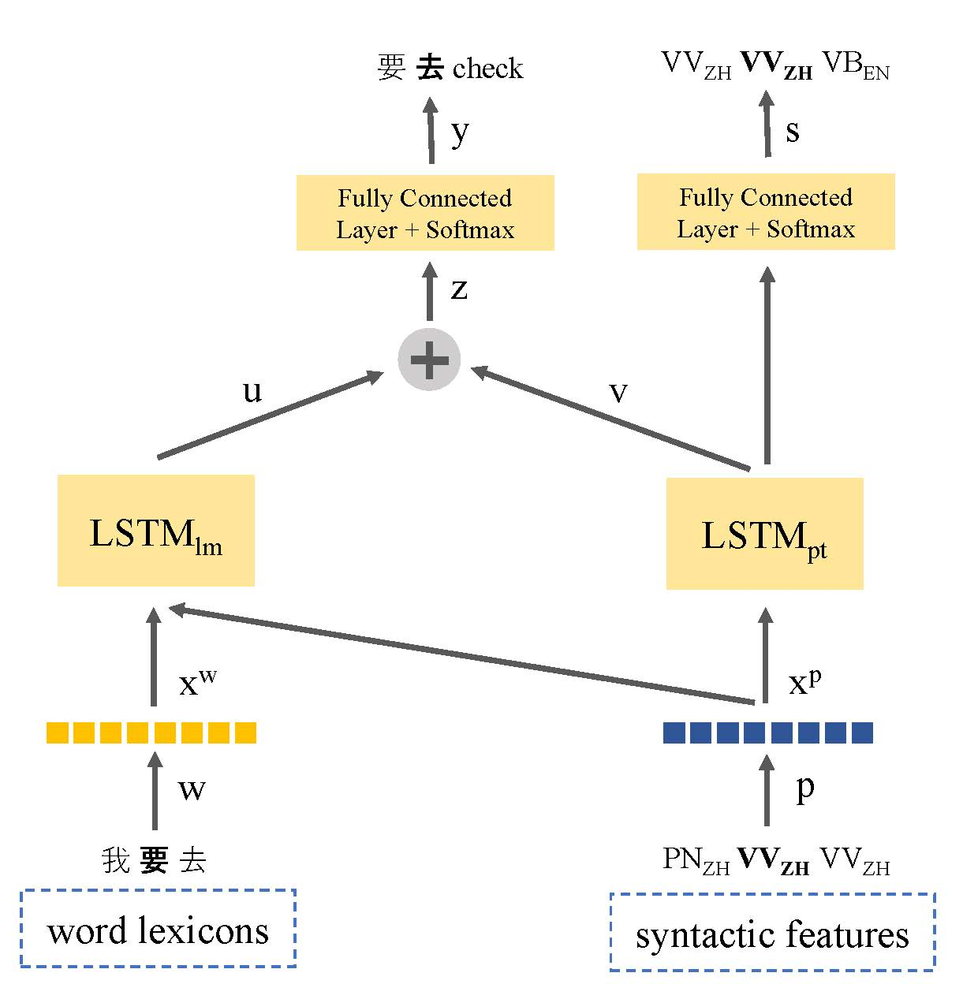

# Code-Switching Language Modeling using Syntax-Aware Multi-Task Learning
The implementation of <a href="http://aclweb.org/anthology/W18-3207">Code-Switching Language Modeling using Syntax-Aware Multi-Task Learning</a> (3rd Workshop in Computational Approaches in Linguistic Code-switching, ACL 2018) paper. The code is written in Python using Pytorch.

If you are using the code in your work, please cite the following
```
@InProceedings{W18-3207,
  author = 	"Winata, Genta Indra
		and Madotto, Andrea
		and Wu, Chien-Sheng
		and Fung, Pascale",
  title = 	"Code-Switching Language Modeling using Syntax-Aware Multi-Task Learning",
  booktitle = 	"Proceedings of the Third Workshop on Computational Approaches to Linguistic Code-Switching",
  year = 	"2018",
  publisher = 	"Association for Computational Linguistics",
  pages = 	"62--67",
  location = 	"Melbourne, Australia",
  url = 	"http://aclweb.org/anthology/W18-3207"
}
```



## Prerequisites:
- Python 3.X
- Pytorch 0.2.X (or later)
- Stanford Core NLP (Tokenization and Segmentation)

## Data
SEAME Corpus from LDC: <a href="https://catalog.ldc.upenn.edu/ldc2015s04">Mandarin-English Code-Switching in South-East Asia</a>

## Run the code:

<b>Multi-task</b>
```
python main_multi_task.py --tied --clip=0.25 --dropout=0.4 --postagdropout=0.4 --p=0.25 --nhid=500 --postagnhid=500 --emsize=500 --postagemsize=500 --cuda --data=../data/seame_phase2
```
